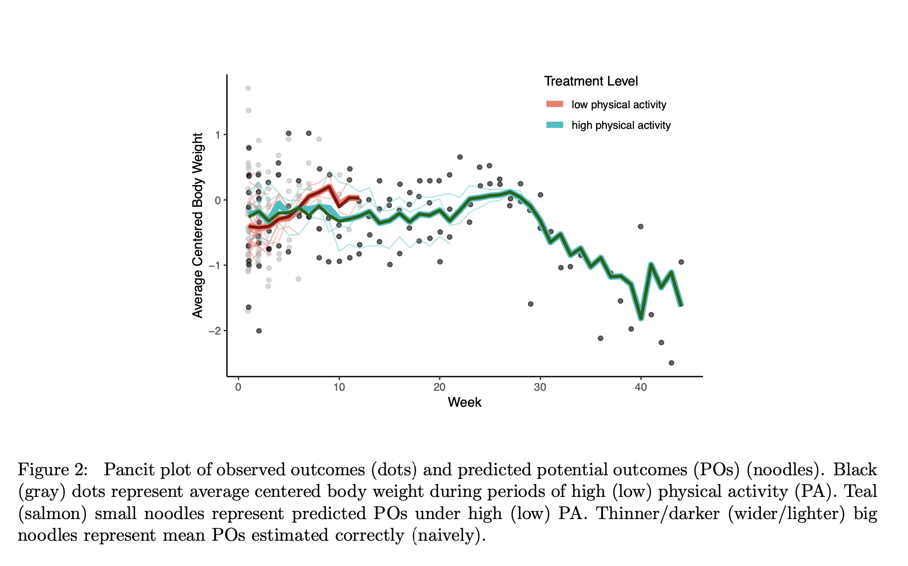

# Daza (2018) Causal Analysis of Self-Tracked Time Series Data using a Counterfactual Framework for N-of-1 Trials

## General procedures

**1.Design**

Raw outcome is per-day average body weight and the constructed is average centered body weight(ACBW) per week(here centered body weight means the difference in body weight from empirical body weight taken over all 6 years).

Raw exposure is engaging in PA on a given day and PA includes multiple kinds of physical activities(running, weight lifting, cycling etc). Constructed exposure is the proportion of days per week when any PA was reported among days when body weight is reported.

The resulting constructed time series consists of 290-293 time points(weeks). Then, changepoint analysis is used to detect the possible period lengths, finding where the mean of an otherwise stationary series changes over time and then partition the series into a sequence of segments. For each segment, PA intensity is defined as high/low if the segment mean is greater/lower than 5/7(i.e, more/less than 5 days of PA per week) 

**2.Notation**

Throughout the article, Daza used the following notations. Random variables and fixed values are written in upper-case and lower-case, respectively. Let $p(A = a)$ denote the probability mass or density of random variable A at a, with shorthand p(a). Let $\{(A)\}$ denote a stochastic process; i.e., a time series of random variables. For any index j, let $\{(j)\}$ denote a sequence. For any random variable B, let $B|A$ denote the event B conditional on A, with shorthand $B|a$ for $B|A = a$. Let $B\perp A$ denote statistical independence of B and A.

Under the setting of APTE, Daza made the following notations. Let$\{(X,Y)\}$ represent a stochastic process. In the basic N1RT, a two-level treatment X is randomized at each time period t, defined as a set of measurement time points. Let t(j) denote a time point within period t for $j=1,...,m_t$. Treatment level is randomized per period only at t(1). We will call a treatment administered in a period consisting of only one time point (i.e., $m_t$ = 1) a point treatment, and write t instead of t(1) in such cases; otherwise, a treatment may be called a period treatment for clarification. 

Since in Daza's case, the effect of $X_t$ on $Y_{t+1}$ is interested in, the pair $\left\{X_{t}, Y_{t+1}\right\}$ will be as an idiographic unit of observation. Let $Y_{t+1}^a$ represent the counterfactual of $Y_{t+1}$ corresponding to $X_t = a$, then the period treatment effect(PTE) will be a contrast between $Y_{t+1}^a$ and $Y_{t+1}^{a'}$ and a contrast between $E(Y_{t+1}^a)$ and $E(Y_{t+1}^{a'})$ is average period treatment effect(APTE). 

**3.Definition of causal effect**

The causal effect is defined as the difference in potential outcomes within a period under different treatment levels.

**4. Causal Inference Assumptions**

1. Causal Consistency (CC) ensures that the outcome we observe is identical to its corresponding potential outcome, i.e., $Y_{t(j+1)}=\sum_aY_t^a I(X_{t(j)}=a)$. 

2. Exchangeability holds when potential outcome not depends on the treatment assignment, i.e., $\{Y_{t(j+1)}^a\}\perp X_{t(j)}|R_{t(j-1)}=1$. Conditional exchangeability is that given all other causes the independence holds, i.e. $\{Y^a\}\perp X|U$. 

3. Positivity is also required for performing estimation. It states that for every set of values of other causes, treatment assignment was not deterministic.

**5.The outcome model**

Assumptions:
1. among a treatment level, only from unstable to stable, not destablization again\
2. $washout\ subperiod \subset stabilization\ subperiod$ for any period\
3. stability point k0\
4. dummy variable k<k0 will be included\
5. current outcome depends on previous outcome and this dependences vary by treatment level

Also, in standard N1RT(n-of-1 randomized trial), only the first treatment is randomized and then held constant for the rest of the period. i.e. $R_{t(0)} = 1$ and $R_{t(j-1)} = 0$ for $j\in (2,...,m_t)$

Therefore, the outcome model is:

$$
\begin{aligned} Y_{t(j+1)}=& \beta_{0}+\left\{1-X_{t(j)}\right\}\left\{X_{t-1(1)}+\left(1-X_{t-1(1)}\right) I\left(m_{t-1}<k_{0}-1\right)\right\} \sum_{k=1}^{k_{0}-1} \beta_{0 k} I(j=k)+\beta_{1} Y_{t(j)}+\\ &\left[\beta_{2}+\left\{\left(1-X_{t-1(1)}\right)+X_{t-1(1)} I\left(m_{t-1}<k_{0}-1\right)\right\} \sum_{k=1}^{k_{0}-1} \beta_{2 k} I(j=k)+\beta_{3} Y_{t(j)}\right] X_{t(j)}+\mathcal{E}_{t(j)} \end{aligned}
$$

where $k_{stable} = \{k:k_0<k<m_t\}$ and $k_{unstable} = \{k:0 < k < k_0\}$, all $\beta$ are parameters need to be estimated. $X_{(t-1)(1)}$ means the treatment on previous period's first time point. $\sum_{k=1}^{k_0-1} \beta_{0k}I(j=k)$ simulate the process if  the time point j is within the unstable period. $I(m_{t-1}<k_0-1)$ simulate the process if the period from 1 to $m_t$ is shorter than $k_0$. 

Then, the average baseline effect(i.e.,baseline average ACBW during weeks of low PA) is $E(Y_{t(k+1)}^0) = \beta_0 + \beta_1 E(Y_{t(k)})$ and apte is $E(Y_{t(k+1)}^1)-E(Y_{t(k+1)}^0) = \beta_2 + \beta_3E(Y_{t(K)})$ for $k \in k_{stable}$. Here, Both $\{Y_{t(k+1)}^a\}$ for $a=0/1$ are potential outcomes. One of them are actually observed and the other is the counterfactual.   

**3.Post-Hoc analysis:**

1.Analysis1: model the change in outcome from the previous outcome, which is $\triangle_{t(j+1)}^Y = Y_{t(j+1)}-Y_{t(j)}$:

$$
\begin{array}{l}\Delta_{t(j+1)}^{Y}=\beta_{0}+\left\{1-X_{t(j)}\right\}\left\{X_{t-1(1)}+\left(1-X_{t-1(1)}\right) I\left(m_{t-1}<k_{0}-1\right)\right\} \sum_{k=1}^{k_{0}-1} \beta_{0 k} I(j=k)+\beta_{1} \Delta_{t(j)}^{Y}+ \\ {\left[\left\{\left(1-X_{t-1(1)}\right)+X_{t-1(1)} I\left(m_{t-1}<k_{0}-1\right)\right\} \sum_{k=1}^{k_{0}-1} \beta_{2 k} I(j=k)\right] X_{t(j)}+\mathcal{E}_{t(j)}}\end{array}
$$

Then, $apte = \sum_{k=1}^{k_0-1} E(\triangle_{t(k+1)}^{Y,1}|x_{t-1(1)}=0,k<k_0) - (k_0-1)E(\triangle_{t(j+1)}^{Y,0}|x_{t-1(1)}=0,j\geq k_0) = \sum_{k=1}^{k_0-1}\beta_{2k}$

2.Analysis2: model the change in outcome from the preivous period's last outcome or the average of its stable outcomes(when $k_0 > m_{t-1}$), $\triangle_{t(j+1)} = Y_{t(j+1)}-Y_{t-1}^*$ and when $m_{t-1} \leq k_0$, $Y_{t-1}^*$ is the previous last outcome; when $m_{t-1} \geq k_0$, $Y_{t-1}^*$ is the average of its stable outcomes.

The model is:

$$
\begin{aligned} \Delta_{t(j+1)}=& \gamma_{0}+\left\{1-X_{t(j)}\right\}\left\{X_{t-1(1)}+\left(1-X_{t-1(1)}\right) I\left(m_{t-1}<k_{0}-1\right)\right\} \sum_{k=1}^{k_{0}-1} \gamma_{0 k} I(j=k)+\gamma_{1} \Delta_{t-1}^{Y}+\\ &\left[\gamma_{2}+\left\{\left(1-X_{t-1(1)}\right)+X_{t-1(1)} I\left(m_{t-1}<k_{0}-1\right)\right\} \sum_{k=1}^{k_{0}-1} \gamma_{2 k} I(j=k)+\gamma_{3} \Delta_{t-1}^{Y}\right] X_{t(j)}+\mathcal{E}_{t(j)} \end{aligned}
$$

The abe(baseline average change in ACBW from $Y_{t-1}^*$) is $E(\triangle_{t(k+1)}^0) = \nu_0 + \nu_1E(\triangle_{t-1}^Y)$ and apte is $E(\triangle_{t(k+1)}^1)-E(\triangle_{t(k+1)}^0) = \nu_2+ \nu_3E(\triangle_{t-1}^Y)$ for $k \in k_{stable}$. 

# Daza (2019) Person as Population:...

First using change point analysis to specify periods t, and then transform the exposure into a binary-valued treatment $X_t=1$ or $X_t=0$ for binary exposure. Non-exposure causes $U$ can include lagged outcome $\bar Y_{t(j)}$ and exposures $\bar X_{t(j)}$.

APTE is a set of contrasts over a period ($E(Y^{a=1})-E(Y^{a=0})$). When $X_t=1$ and $X_{t(j)}=1$, the potential outcome $Y_{t(j)}^{a=1}$ is equal to observed outcome $Y_{t(j)}$. When $X_t=1$ and $X_{t(j)}=0$, the potential outcome $Y_{t(j)}^{a=1}$ is "missing", so we need to predict it conditional on exposure and non-exposure causes by using the model we specified or the model obtained by supervised learning, and vice versa. After this step, we will get  $E\left[Y_{t(j+1)}|U_{t(j)},X_{t(j)}=1\right]$ and $E\left[Y_{t(j+1)}|U_{t(j)},X_{t(j)}=0\right]$ for each time period $t$.

For now, we have predicted potential outcome at some time points $Y_{t(j)}^a$ and with observed outcome at other time points $Y_{t(j')}$ (should all be potential outcomes, but with consistency assumption, some potential outcomes can be represented by observed outcomes $Y_{t(j')}^a=\{Y_{t(j')}|X=a\}$). 

The weighted average over all non-exposure causes $U$, using the g-formula specified below (1) and (2), is taken to get the **trajectory of estimated mean POs**, which are $\hat E(Y^1)$ and $\hat E(Y^0)$, for each time period. The weights are derived from the empirical **marginal CSC distribution** with marginal distribution $f(U)$ as required by the g-formula. 

With consistency assumption, when $U$ is continuous,
$$
E\left[Y^a\right]=E_{U_{t(j)}}\left[E\left[Y_{t(j+1)}|U_{t(j)},X_{t(j)}=a\right]\right]=\int_UE\left[Y_{t(j+1)}|U_{t(j)},X_{t(j)}=a\right]f(U_{t(j)}), \tag{1}
$$

and when $U$ is discrete,
$$
E\left[Y^a\right]=E_{U_{t(j)}}\left[E\left[Y_{t(j+1)}|U_{t(j)},X_{t(j)}=a\right]\right]=\sum_UE\left[Y_{t(j+1)}|U_{t(j)},X_{t(j)}=a\right]p(U_{t(j)}). \tag{2}
$$

Finalliy, report the estimated APTE as the trajectory of pre-defined **contrasts** (e.g. $\hat E(Y^1)-\hat E(Y^0)$). 

# Formula from Linda

Assume that $X_{t(j)}$ precedes $Y_{t(j)}$

* Time point-wise treatment effect

$$
E\left[Y_{t(j)}^{a=X_{t(j)}}\right]-E\left[Y_{t(j)}^{a^*=X_{t(j)}^{*}}\right]
$$

* Cumulative treatment effect

$$
\boldsymbol{a}=a_{t,1},...,a_{t,j}
$$

$$
\bar{X}_{t(j)}=(X_{t,1},...,X_{t,j})
$$

$$
E\left[Y_{t(j)}^{\boldsymbol a}\right]-E\left[Y_{t(j)}^{\boldsymbol a^*}\right]
$$

# The difference among the three ways to calculate the APTE

The definition and method of APTE estimation are different between Linda and Daza. The APTE mentioned in Daza (2018) is calculated condition on *previous period's exposure being equal to 0* in observed data, and estimate the $\beta_{2k}$ which are the coefficients of exposure at the time point before stable point $k_0$. The final estimated APTE we get is the APTE average across 6 six years. 

The APTE mentioned in Daza (2019) is not conditioned on the previous period's exposure level. Instead, each period is regard as an individual, and then, the weighted POs are estimated with weights derived from the empirical *marginal* CSC distribution as required by the **g-formula**. Plus, no stability point is mentioned, but the stationarity of confounder or simultaneous cause (CSC) need to be statisfied for the *APTE g-formula estimator* to be consistent for an effect-stable APTE. The final estimated APTE is for each time point (a trajectory of pre-defined contrast), and since each period is seen as an individual and have different length, the length of APTE is decided by the shortest period which is over at least 11 weeks (the analysis results from Daza (2018), saying that "estimated APTE may have been stable between 11 and 17 weeks of high PA").

As for Linda's APTE, the effect is considered within the current period (or including some of the the previous period time points if we change the defination of $\bar X_{t(j)}$), which means the Linda's cumulative effect include the *non-exposure causes* that defined in Daza (2019).

# Modeling (state space model)

Shu Li (*Estimating heterogeneous treatment effects in nonstationary time series with state-space models*, 2020) proposed a method Causal Transfer to estimate the causal effect in non-stationary time series. Causal Transfer can be used to predict population and sample treatment efect, and we will use the sample version to calculate the $apte_j$ we defined before. [Shu's idea: Sample from the  distribution of outcomes, can we use the distribution of state?]

1. Estimate the unknown parameters with MLE and plug them into the model. 

2. For all time points, smoothing distribution $N(s_{t(j)},S_{t(j)})$ of the states $\theta_{t(j)}$ will be estimated by iterating the smoothing recursions (need to change notations)

$$
\begin{aligned}
s_t&=m_t+C_tG'_{t+1}R_{t+1}^{-1}(s_{t+1}-a_{t+1})\\
S_t&=C_tG'_{t+1}R_{t+1}^{-1}(R_{t+1}-S_{t+1})R_{t+1}^{-1}G_{t+1}C_t.
\end{aligned}
$$

3. Given the smoothing distribution, we estimate the distribution $N(\tilde a_j,\tilde P_j)$ of the **counterfactuals** with $\tilde a_j=\tilde Z_js_j$ and $\tilde P_j=\tilde Z_jS_j\tilde Z'_j+H_j$. $\tilde Z_j$ is the same as $Z_j$ except for $X_j$ being replaced by $\tilde X_j=|X_j-1|$. 

4. Draw B sets of samples $(\tilde y_j^{(b)})_{b=1}^B$ from $N(\tilde a_j,\tilde P_j)$ to impute the missing outcome (counterfactuals). 

5. The effect would be calcualted by $\hat\tau_j^{(b)}=(\tilde y_j^{(b)}-y_j)(\tilde X_j-X_j)$. 

6. Finally, we will get the mean and interval of estimated effects by taking average and percentile of $(\tilde y_j^{(b)})_{b=1}^B$.

# Some thoughts:

## state space model and marginal structural mean model

Marginal structural mean model: treatment effect is $\beta_1$.

$$
\mathrm{E}\left[Y^{X=a} \mid U\right]=\beta_{0}+\beta_{1} X+\beta_{2} U
$$

State space model: treatment effect is $a_{1,j}$.

$$
Y_j=\beta_{0}+\beta_{1,j} X_j+\beta_{2,j} U_j
$$

$$
\mathrm{E}\left[Y_j^{X=a} \mid U\right]=\beta_{0}+a_{1,j} X_j+a_{2,j} U_j
$$

where, $\beta_{1,j}\sim N(a_{1,j},P_{1,j})$, $\beta_{2,j}\sim N(a_{2,j},P_{2,j})$.

### State space model in general

Let $\alpha_{t(j)}$ represent the values of the state at time point $t(j)$. The outcome is denoted by a vector $y_{t(j)}$ which is a linear combination of treatment and other covariates $Z_{t(j)}$ with coeffecient matrix $\alpha_{t(j)}$. In time period t the state space model is

$$
\begin{aligned}
y_{t(j)}&=Z_{t(j)}\alpha_{t(j)}+\varepsilon_{t(j)}\\
\alpha_{t+1(j)}&=T_{t(j)}\alpha_{t(j)}+R_{t(j)}\eta_{t(j)}
\end{aligned}
$$
$$
\tag{4.1}
$$
where $\alpha_{t(1)}\sim N(a_{t,1},P_{t,1})$, $\varepsilon_{t(j)}\sim N(0, H_{t(j)})$, and $\eta_{t(j)}\sim N(0, Q_{t(j)})$. Random variation has mean zero and is uncorrelated over time.

Let $Y_{t(j-1)}$ denote the set of past observations $y_{t(1)},...,y_{t(j-1)}$ for $j=2,3...$.

### Kalman filter

The discussion is in a specific time peiod, so for simplicity, we change $t(j)$ to $j$. Let $a_{j|j}=E(\alpha_j|Y_j)$, $a_{j+1}=E(\alpha_{j+1}|Y_j)$, $P_{j|j}=Var(\alpha_j|Y_j)$ and $P_{j+1}=Var(\alpha_{j+1}|Y_j)$. Therefore, the filtering distributions of $\alpha_j$ given $Y_j$ and $\alpha_{j+1}$ given $Y_j$ are given by $N(a_{j|j}, P_{j|j})$ and $N(a_{j+1}, P_{j+1})$ 

The Kalman filter would be 

$$
\begin{aligned}
v_j&=y_j-Z_j a_j\;(\text{forecast error})\\
F_j&=Z_jP_j Z'_j\\
a_{j|j}&=a_j+P_j Z'_j F_j^{-1}v_j\\
P_{j|j}&=P_j-P_jZ'_jF_j^{-1}Z_jP_j\\ 
a_{j+1}&=T_ja_j+K_jv_j\\
P_{t+1}&=T_jP_j(T_j-K_jZ_j)'+R_jQ_jR'_j
\end{aligned}
$$

$$
\tag{4.2}
$$

for $t=1,...,m_t$, where *Kalman gain* $K_t=T_tP_tZ'_tF_t^{-1}$. $\alpha_j-a_j$ is state estimations errors.

## g-formula and state space model

* The potential outcomes are predicted by state space model rather than using the g-formula. But is there any **similarity or differrence** between those two?

Difference: One's APTE is calculated by the constrast between mean POs, the other one's APTE will be estimated directly by fitting the state space model.

G-formula: $\sum$ {conditional predicted potential outcome} $\times$ {the marginal distribution of non-exposure causes $U$}.

Causal Transfer: $U$ show as an variable in the model, which means the coefficient is already conditional on $U$. So to impute missing potential outcomes, we only need to change $X=a$ to $X=a'$.

